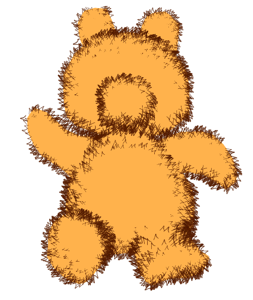
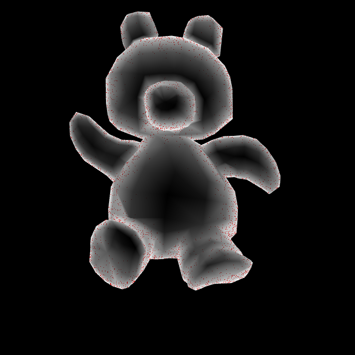
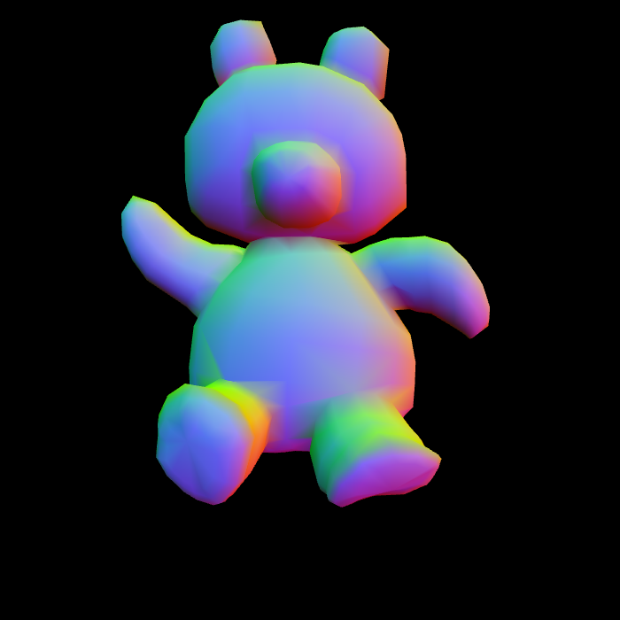
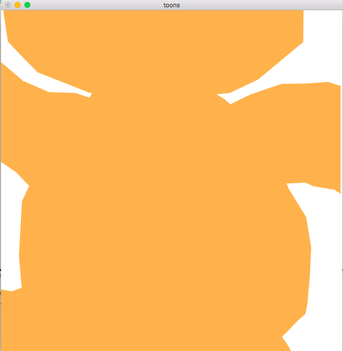
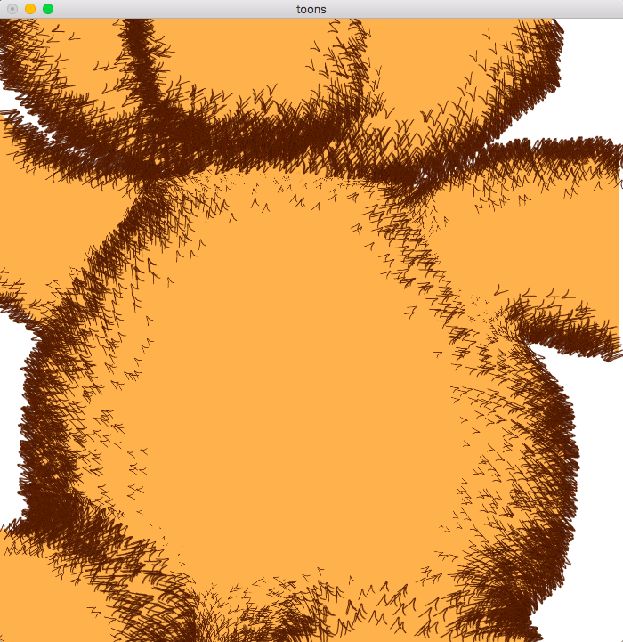
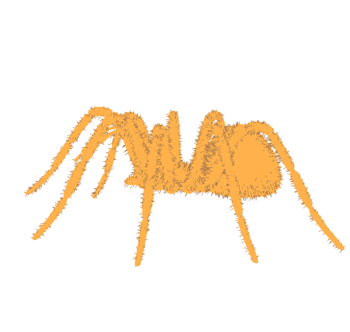

# FurToons
This is an image based technique to stylistically draw fur on characters. The style is heavily influenced by Dr. Seuss' artwork. Here's a sample of output:

The technique works by first creating a "desire map" – parts of the render where it's desirable to place the fur.

We then create a normal map of the render, to orient the fur.

Finally, you place the fur based on the desired density. Note how the fur density is dynamically adjusted (compare to the first image above).

 

The technique is dynamic enough to go beyond Dr. Seuss' style. To demonstrate that, here's a hairy scary spider:

## Project Structure
The root directory contains the following folders:
`src`: Contains the source code of the program
`doc`: Contains the pictorial-documentation of the program
`models`: assets of the program, containin the 3D models
`furs`:  image files for furs.

## Make
Open Terminal, go to the root folder of the project. Run `make`.

## Run
`runThis` will be created as an executable after `make` is run. Run the program: `./runThis`.

## Usage
`Main.cc` corresponds to the driver of the code. `Controller.h` has to be included to use the functionality that's being used in `Main.cc`.
The Controller module is the interface and provides the following functionality:

`loadPly (string s)`
*A function to load the PLY files.*
`s`: File name of the ply file

`init ()`
*Function to initiate the rendering sequence. Is a blocking call.*

`setParams (int spread, float density, float length, int rotate, int useTexture)`
*Sets the fur parameters. Variable names self-explanatory.*
`spread`: The diffusion of the fur wrt the gradient. range 0 to 254 strict
`density`: density of fur in the selected area. range 0 to 10 ideal
`length`: fur length. range 0 to 1 ideal
`rotate`: rotate the model if original model is not right.
`useTexture`: uses texture specified by setFur method call. See below.

`setFur (string furImageFile)`
*Takes the fur image file name as a parameter and loads it. Works only if useTexture in the previous call is 1.*

## Misc. Notes
The code has been implemented and tested on Mac OSX and has not been tested on a Linux Machine. However, I believe I have made the code and makefile portable for both Linux and OSX and will probably run on both, with varying functionality. When tested, all functionality proposed in DOC worked on the OSX and only a subset on Ubuntu 14.04.
